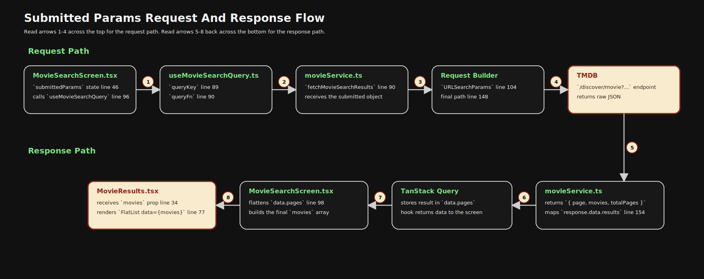
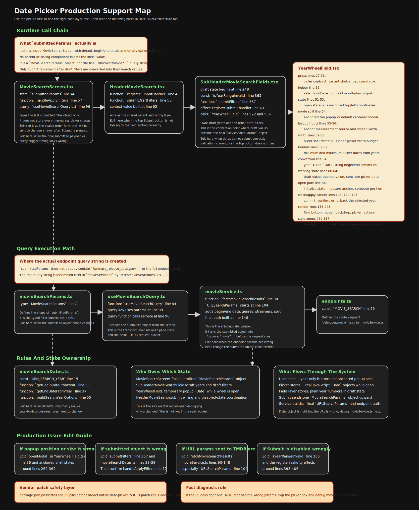

# Date Picker Architecture

Last updated: April 19, 2026

## Purpose Of This File

This file replaces the old `year-wheel-plan.md` and `react-native-date-picker-history.md`.

It is the single source of truth for:

- the current date-picker architecture
- the runtime call flow
- the files and lines a developer should inspect when supporting it
- the vendor patch and why it exists
- the implementation history that led to the current design
- the recovery steps if the picker breaks again

Reference diagram:

- [react-native-date-picker-flow.svg](./assets/react-native-date-picker-flow.svg)

## Current Architecture

The app shows year-only controls to the user, but it does not send raw years to the movie query. The visible buttons only display a year. The app converts that year into real query dates only when the user presses `Submit`.

The most important state distinction is this:

- `submittedParams` is not the final endpoint query string
- `submittedParams` is a typed `MovieSearchParams` object that holds the last submitted filter payload
- the real TMDB query string is built later in `fetchMovieSearchResults(...)` with `URLSearchParams`

That means the flow is:

1. the screen stores a submitted filter object
2. the query hook receives that object
3. the service layer turns that object into `/discover/movie?...`

If someone forgets this later, the safe mental model is: `submittedParams` is the sealed order form, not the shipping label. The shipping label gets printed later in the service layer.

Current ownership is split across five main places:

1. [MovieSearchScreen.tsx](vscode://file/Users/croncallo/repo/MovieApp/src/screens/MovieSearchScreen.tsx:46:1) owns only the submitted search params and the query hook. It is the page composer, not the draft-filter owner.
2. [HeaderMovieSearch.tsx](vscode://file/Users/croncallo/repo/MovieApp/src/components/header/HeaderMovieSearch.tsx:41:1) owns the shared header coordination. It keeps the submit button disabled state, stores the registered submit handler, and lets the top header trigger the field-area submit logic without moving all that wiring back into the screen.
3. [SubHeaderMovieSearchFields.tsx](vscode://file/Users/croncallo/repo/MovieApp/src/components/header/SubHeaderMovieSearchFields.tsx:248:1) owns the draft filter state, including `beginYear` and `endYear`. It is the only component that currently calls the reusable year picker.
4. [YearWheelField.tsx](vscode://file/Users/croncallo/repo/MovieApp/src/components/ui/YearWheelField.tsx:42:1) renders each visible date button and the popup shell around the native picker. It turns a selected year into a real JavaScript `Date` object so the native picker can work with it.
5. [movieSearchDates.ts](vscode://file/Users/croncallo/repo/MovieApp/src/utils/movieSearchDates.ts:15:1) centralizes the business rules so the screen, header, and picker all agree on the same year-to-date conversions.

## Business Rules Still In Force

These rules came out of the earlier year-wheel planning work and are still the live rules today:

- minimum year is `1960`
- future years are not allowed
- default begin year is current year minus `5`
- default end year is the current year
- begin year `YYYY` becomes `YYYY-01-01`
- end year `YYYY` becomes today's date if `YYYY` is the current year
- end year `YYYY` becomes `YYYY-12-31` for earlier years
- no search runs when the wheel changes
- the search runs only when the top `Submit` button is pressed
- the year range is invalid when begin year is later than end year

The live conversions for those rules are in:

- [movieSearchDates.ts](vscode://file/Users/croncallo/repo/MovieApp/src/utils/movieSearchDates.ts:33:1)
- [SubHeaderMovieSearchFields.tsx](vscode://file/Users/croncallo/repo/MovieApp/src/components/header/SubHeaderMovieSearchFields.tsx:367:1)

## How It Is Called

### Request And Response Flow

Direct file link: [date-picker-request-response-flow.svg](./assets/date-picker-request-response-flow.svg)

Read arrows `1-4` across the top for the request path. Read arrows `5-8` back across the bottom for the response path that ends in `MovieResults`.

### Full Support Map

Direct file link: [date-picker-support-map.svg](./assets/date-picker-support-map.svg)

Use this picture first when something breaks in production. It shows the live code chain, the main functions/constants involved, and the fastest edit hotspots before the detailed file-by-file notes below.

### YearWheelField Responsibility Notes

- [YearWheelField.tsx](vscode://file/Users/croncallo/repo/MovieApp/src/components/ui/YearWheelField.tsx:27:1) `YearWheelFieldProps`
  Defines the public contract for the component.
  This is where support work starts if a caller needs a new option, a new display mode, or different year semantics.

- [YearWheelField.tsx](vscode://file/Users/croncallo/repo/MovieApp/src/components/ui/YearWheelField.tsx:36:1) `buildDate`
  Safely builds a real date while clamping the day to the last day of the month.
  This protects the end-year path when the current day does not exist in a shorter month.

- [YearWheelField.tsx](vscode://file/Users/croncallo/repo/MovieApp/src/components/ui/YearWheelField.tsx:51:1) popup state
  `isModalVisible`, `anchoredModalTop`, and `anchoredModalLeft` control whether the popup is open and where the anchored version is placed.
  Inspect this state when the popup opens in the wrong place, refuses to open, or closes unexpectedly.

- [YearWheelField.tsx](vscode://file/Users/croncallo/repo/MovieApp/src/components/ui/YearWheelField.tsx:54:1) `isAnchoredDate`
  Switches the component between the app-owned anchored date popup and the default centered modal path.
  If a support issue affects only one visual mode, this branch is the first split to understand.

- [YearWheelField.tsx](vscode://file/Users/croncallo/repo/MovieApp/src/components/ui/YearWheelField.tsx:55:1) `anchorRef` and [YearWheelField.tsx](vscode://file/Users/croncallo/repo/MovieApp/src/components/ui/YearWheelField.tsx:56:1) `windowWidth`
  Provide the measurement inputs for anchored popup placement.
  These matter for layout, screen-edge behavior, and alignment issues.

- [YearWheelField.tsx](vscode://file/Users/croncallo/repo/MovieApp/src/components/ui/YearWheelField.tsx:57:1) `anchoredModalWidth` and [YearWheelField.tsx](vscode://file/Users/croncallo/repo/MovieApp/src/components/ui/YearWheelField.tsx:58:1) `anchoredPickerWidth`
  Control the outer shell width and the inner picker width budget.
  Inspect these when the popup is too wide, too narrow, clipped, or visually off-center.

- [YearWheelField.tsx](vscode://file/Users/croncallo/repo/MovieApp/src/components/ui/YearWheelField.tsx:59:1) through [YearWheelField.tsx](vscode://file/Users/croncallo/repo/MovieApp/src/components/ui/YearWheelField.tsx:62:1) year bounds
  Convert the allowed `years` array into real minimum and maximum `Date` limits for the native picker.
  This is the boundary logic for out-of-range scrolling problems.

- [YearWheelField.tsx](vscode://file/Users/croncallo/repo/MovieApp/src/components/ui/YearWheelField.tsx:64:1) `getDisplayDateForYear`
  Converts the visible year number into the exact `Date` that the native picker should display.
  This is where begin-year and end-year semantics diverge.

- [YearWheelField.tsx](vscode://file/Users/croncallo/repo/MovieApp/src/components/ui/YearWheelField.tsx:80:1) `draftDate`, [YearWheelField.tsx](vscode://file/Users/croncallo/repo/MovieApp/src/components/ui/YearWheelField.tsx:81:1) `anchoredOpenedDate`, and [YearWheelField.tsx](vscode://file/Users/croncallo/repo/MovieApp/src/components/ui/YearWheelField.tsx:84:1) `pickerDate`
  Hold the temporary working value, the original value at open time, and the concrete `Date` passed to the picker.
  This is the core state cluster for commit, cancel, and rollback behavior.

- [YearWheelField.tsx](vscode://file/Users/croncallo/repo/MovieApp/src/components/ui/YearWheelField.tsx:86:1) `openModal`
  Resets popup working state, measures the anchor, computes `top` and `left`, and opens the popup.
  This is the main entry point for open behavior and anchored positioning.

- [YearWheelField.tsx](vscode://file/Users/croncallo/repo/MovieApp/src/components/ui/YearWheelField.tsx:108:1) `closeModal`
  Closes the popup and, in anchored mode, commits the current draft year.
  This is important because the anchored flow treats `Close` as a commit path, not just a dismiss path.

- [YearWheelField.tsx](vscode://file/Users/croncallo/repo/MovieApp/src/components/ui/YearWheelField.tsx:120:1) `applySelection`
  Commits the current draft year for the default modal flow and closes the picker.
  This is the explicit confirm action for the non-anchored variant.

- [YearWheelField.tsx](vscode://file/Users/croncallo/repo/MovieApp/src/components/ui/YearWheelField.tsx:125:1) `cancelAnchoredSelection`
  Restores the value that existed when the anchored popup opened and then closes the popup.
  This is the rollback path for anchored cancel behavior.

- [YearWheelField.tsx](vscode://file/Users/croncallo/repo/MovieApp/src/components/ui/YearWheelField.tsx:133:1) through [YearWheelField.tsx](vscode://file/Users/croncallo/repo/MovieApp/src/components/ui/YearWheelField.tsx:149:1) trigger field
  Render the visible button the user taps.
  Inspect this block when the field label, tap target, or anchored-vs-default trigger appearance is wrong.

- [YearWheelField.tsx](vscode://file/Users/croncallo/repo/MovieApp/src/components/ui/YearWheelField.tsx:152:1) through [YearWheelField.tsx](vscode://file/Users/croncallo/repo/MovieApp/src/components/ui/YearWheelField.tsx:243:1) popup render tree
  Render the modal, backdrop, anchored shell, native picker mount, and action buttons.
  This is the main render path for most UI, interaction, and composition bugs.

- [YearWheelField.tsx](vscode://file/Users/croncallo/repo/MovieApp/src/components/ui/YearWheelField.tsx:171:1) anchored wrapper width and [YearWheelField.tsx](vscode://file/Users/croncallo/repo/MovieApp/src/components/ui/YearWheelField.tsx:185:1) picker width usage
  These are the concrete render sites where the width constants are applied.
  Inspect these when the numbers look right in the constants but wrong on screen.

- [YearWheelField.tsx](vscode://file/Users/croncallo/repo/MovieApp/src/components/ui/YearWheelField.tsx:269:1) through [YearWheelField.tsx](vscode://file/Users/croncallo/repo/MovieApp/src/components/ui/YearWheelField.tsx:357:1) anchored styles
  Define the anchored field button, popup shell, action row, and action buttons.
  This is the visual styling zone for the tan/red anchored experience.

- [YearWheelField.tsx](vscode://file/Users/croncallo/repo/MovieApp/src/components/ui/YearWheelField.tsx:289:1) through [YearWheelField.tsx](vscode://file/Users/croncallo/repo/MovieApp/src/components/ui/YearWheelField.tsx:320:1) container and shell styles
  Control the backdrop, root modal layout, anchored shell positioning container, and picker frame.
  Inspect these for spacing, centering, layering, and visual-shell issues.

### Example Support Ticket Inspection Paths

1. `Backdrop`: If the support ticket is "change the backdrop tint" or "dim the background more or less," the first inspection path should be:
   [YearWheelField.tsx](vscode://file/Users/croncallo/repo/MovieApp/src/components/ui/YearWheelField.tsx:158:1) `modalRoot`
   [YearWheelField.tsx](vscode://file/Users/croncallo/repo/MovieApp/src/components/ui/YearWheelField.tsx:160:1) backdrop attachment
   [YearWheelField.tsx](vscode://file/Users/croncallo/repo/MovieApp/src/components/ui/YearWheelField.tsx:295:1) `backdrop`
   [YearWheelField.tsx](vscode://file/Users/croncallo/repo/MovieApp/src/components/ui/YearWheelField.tsx:299:1) `anchoredDateBackdrop`

2. `Bounds`: If the support ticket is "the picker is allowing the wrong years" or "future years should not be selectable," the first inspection path should be:
   [YearWheelField.tsx](vscode://file/Users/croncallo/repo/MovieApp/src/components/ui/YearWheelField.tsx:59:1) `minimumYear`
   [YearWheelField.tsx](vscode://file/Users/croncallo/repo/MovieApp/src/components/ui/YearWheelField.tsx:60:1) `maximumYear`
   [YearWheelField.tsx](vscode://file/Users/croncallo/repo/MovieApp/src/components/ui/YearWheelField.tsx:61:1) `minimumDate`
   [YearWheelField.tsx](vscode://file/Users/croncallo/repo/MovieApp/src/components/ui/YearWheelField.tsx:62:1) `maximumDate`
   [YearWheelField.tsx](vscode://file/Users/croncallo/repo/MovieApp/src/components/ui/YearWheelField.tsx:179:1) and [YearWheelField.tsx](vscode://file/Users/croncallo/repo/MovieApp/src/components/ui/YearWheelField.tsx:180:1) anchored picker min/max usage
   [movieSearchDates.ts](vscode://file/Users/croncallo/repo/MovieApp/src/utils/movieSearchDates.ts:55:1) `buildSearchYearOptions`

3. `Buttons`: If the support ticket is "change the button labels," "add a third button," or "adjust button spacing," the first inspection path should be:
   [YearWheelField.tsx](vscode://file/Users/croncallo/repo/MovieApp/src/components/ui/YearWheelField.tsx:189:1) `anchoredDateActionsRow`
   [YearWheelField.tsx](vscode://file/Users/croncallo/repo/MovieApp/src/components/ui/YearWheelField.tsx:191:1) `Cancel` button
   [YearWheelField.tsx](vscode://file/Users/croncallo/repo/MovieApp/src/components/ui/YearWheelField.tsx:202:1) `Close` button
   [YearWheelField.tsx](vscode://file/Users/croncallo/repo/MovieApp/src/components/ui/YearWheelField.tsx:323:1) `anchoredDateActionsRow` style
   [YearWheelField.tsx](vscode://file/Users/croncallo/repo/MovieApp/src/components/ui/YearWheelField.tsx:330:1) `anchoredDateCloseButton`
   [YearWheelField.tsx](vscode://file/Users/croncallo/repo/MovieApp/src/components/ui/YearWheelField.tsx:344:1) `anchoredDateSecondaryButton`

4. `Cancel Restore`: If the support ticket is "Cancel should restore the original year from when the popup opened," the first inspection path should be:
   [YearWheelField.tsx](vscode://file/Users/croncallo/repo/MovieApp/src/components/ui/YearWheelField.tsx:81:1) `anchoredOpenedDate`
   [YearWheelField.tsx](vscode://file/Users/croncallo/repo/MovieApp/src/components/ui/YearWheelField.tsx:87:1) through [YearWheelField.tsx](vscode://file/Users/croncallo/repo/MovieApp/src/components/ui/YearWheelField.tsx:89:1) open-time state capture
   [YearWheelField.tsx](vscode://file/Users/croncallo/repo/MovieApp/src/components/ui/YearWheelField.tsx:125:1) `cancelAnchoredSelection`
   [YearWheelField.tsx](vscode://file/Users/croncallo/repo/MovieApp/src/components/ui/YearWheelField.tsx:191:1) cancel button wiring

5. `Commit Rules`: If the support ticket is "tapping outside should not commit the year" or "system back should dismiss without saving," the first inspection path should be:
   [YearWheelField.tsx](vscode://file/Users/croncallo/repo/MovieApp/src/components/ui/YearWheelField.tsx:156:1) `onRequestClose`
   [YearWheelField.tsx](vscode://file/Users/croncallo/repo/MovieApp/src/components/ui/YearWheelField.tsx:161:1) backdrop `onPress`
   [YearWheelField.tsx](vscode://file/Users/croncallo/repo/MovieApp/src/components/ui/YearWheelField.tsx:108:1) `closeModal`
   [YearWheelField.tsx](vscode://file/Users/croncallo/repo/MovieApp/src/components/ui/YearWheelField.tsx:120:1) `applySelection`
   [YearWheelField.tsx](vscode://file/Users/croncallo/repo/MovieApp/src/components/ui/YearWheelField.tsx:125:1) `cancelAnchoredSelection`

6. `Position X`: If the support ticket is "move the anchored popup left" or "move it right," the first inspection path should be:
   [YearWheelField.tsx](vscode://file/Users/croncallo/repo/MovieApp/src/components/ui/YearWheelField.tsx:53:1) `anchoredModalLeft`
   [YearWheelField.tsx](vscode://file/Users/croncallo/repo/MovieApp/src/components/ui/YearWheelField.tsx:86:1) `openModal`
   [YearWheelField.tsx](vscode://file/Users/croncallo/repo/MovieApp/src/components/ui/YearWheelField.tsx:98:1) `centeredLeft`
   [YearWheelField.tsx](vscode://file/Users/croncallo/repo/MovieApp/src/components/ui/YearWheelField.tsx:99:1) `nextLeft`
   [YearWheelField.tsx](vscode://file/Users/croncallo/repo/MovieApp/src/components/ui/YearWheelField.tsx:170:1) anchored wrapper `left` usage
   [YearWheelField.tsx](vscode://file/Users/croncallo/repo/MovieApp/src/components/ui/YearWheelField.tsx:302:1) `anchoredDateModalAnchor`

7. `Position Y`: If the support ticket is "move the anchored popup higher" or "move it lower," the first inspection path should be:
   [YearWheelField.tsx](vscode://file/Users/croncallo/repo/MovieApp/src/components/ui/YearWheelField.tsx:52:1) `anchoredModalTop`
   [YearWheelField.tsx](vscode://file/Users/croncallo/repo/MovieApp/src/components/ui/YearWheelField.tsx:86:1) `openModal`
   [YearWheelField.tsx](vscode://file/Users/croncallo/repo/MovieApp/src/components/ui/YearWheelField.tsx:100:1) `nextTop` calculation
   [YearWheelField.tsx](vscode://file/Users/croncallo/repo/MovieApp/src/components/ui/YearWheelField.tsx:169:1) anchored wrapper `top` usage
   [YearWheelField.tsx](vscode://file/Users/croncallo/repo/MovieApp/src/components/ui/YearWheelField.tsx:302:1) `anchoredDateModalAnchor`

8. `Shell Style`: If the support ticket is "change the popup shell color, border, or corner radius," the first inspection path should be:
   [YearWheelField.tsx](vscode://file/Users/croncallo/repo/MovieApp/src/components/ui/YearWheelField.tsx:175:1) anchored shell render
   [YearWheelField.tsx](vscode://file/Users/croncallo/repo/MovieApp/src/components/ui/YearWheelField.tsx:306:1) `anchoredDateModalCard`
   [YearWheelField.tsx](vscode://file/Users/croncallo/repo/MovieApp/src/components/ui/YearWheelField.tsx:313:1) shell `backgroundColor`
   [YearWheelField.tsx](vscode://file/Users/croncallo/repo/MovieApp/src/components/ui/YearWheelField.tsx:314:1) through [YearWheelField.tsx](vscode://file/Users/croncallo/repo/MovieApp/src/components/ui/YearWheelField.tsx:318:1) shell border styling

9. `Title`: If the support ticket is "add a title at the top of the anchored popup," the first inspection path should be:
   [YearWheelField.tsx](vscode://file/Users/croncallo/repo/MovieApp/src/components/ui/YearWheelField.tsx:28:1) `title` prop
   [YearWheelField.tsx](vscode://file/Users/croncallo/repo/MovieApp/src/components/ui/YearWheelField.tsx:164:1) anchored popup render branch
   [YearWheelField.tsx](vscode://file/Users/croncallo/repo/MovieApp/src/components/ui/YearWheelField.tsx:175:1) `anchoredDateModalCard`
   [YearWheelField.tsx](vscode://file/Users/croncallo/repo/MovieApp/src/components/ui/YearWheelField.tsx:211:1) existing default-modal title example
   [YearWheelField.tsx](vscode://file/Users/croncallo/repo/MovieApp/src/components/ui/YearWheelField.tsx:379:1) `modalTitle` style as a reuse reference

10. `Width`: If the support ticket is exactly "widen the popup by 3 pixels on each side," the first inspection path should be:
   [YearWheelField.tsx](vscode://file/Users/croncallo/repo/MovieApp/src/components/ui/YearWheelField.tsx:57:1) `anchoredModalWidth`
   [YearWheelField.tsx](vscode://file/Users/croncallo/repo/MovieApp/src/components/ui/YearWheelField.tsx:58:1) `anchoredPickerWidth`
   [YearWheelField.tsx](vscode://file/Users/croncallo/repo/MovieApp/src/components/ui/YearWheelField.tsx:171:1) anchored wrapper width usage
   [YearWheelField.tsx](vscode://file/Users/croncallo/repo/MovieApp/src/components/ui/YearWheelField.tsx:185:1) picker width usage
   [YearWheelField.tsx](vscode://file/Users/croncallo/repo/MovieApp/src/components/ui/YearWheelField.tsx:306:1) `anchoredDateModalCard`

The runtime flow is:

1. [MovieSearchScreen.tsx](vscode://file/Users/croncallo/repo/MovieApp/src/screens/MovieSearchScreen.tsx:46:1) creates `submittedParams` as a `MovieSearchParams` object with default dates and empty optional filters. No other component injects the initial value.
2. [MovieSearchScreen.tsx](vscode://file/Users/croncallo/repo/MovieApp/src/screens/MovieSearchScreen.tsx:153:1) renders `HeaderMovieSearch` and places `SubHeaderMovieSearchFields` above the results list.
3. [HeaderMovieSearch.tsx](vscode://file/Users/croncallo/repo/MovieApp/src/components/header/HeaderMovieSearch.tsx:62:1) creates the shared header context and exposes `registerSubmitHandler`, `submitDraftFilters`, and the invalid-state callback.
4. [SubHeaderMovieSearchFields.tsx](vscode://file/Users/croncallo/repo/MovieApp/src/components/header/SubHeaderMovieSearchFields.tsx:401:1) registers its `submitFilters` function into that context so the top `Submit` button can call it later.
5. [SubHeaderMovieSearchFields.tsx](vscode://file/Users/croncallo/repo/MovieApp/src/components/header/SubHeaderMovieSearchFields.tsx:522:1) renders two `YearWheelField` instances. Right now those are the only two live callers:
   - [SubHeaderMovieSearchFields.tsx](vscode://file/Users/croncallo/repo/MovieApp/src/components/header/SubHeaderMovieSearchFields.tsx:522:1) for the begin year
   - [SubHeaderMovieSearchFields.tsx](vscode://file/Users/croncallo/repo/MovieApp/src/components/header/SubHeaderMovieSearchFields.tsx:536:1) for the end year
6. When the user taps one of those fields, [YearWheelField.tsx](vscode://file/Users/croncallo/repo/MovieApp/src/components/ui/YearWheelField.tsx:86:1) opens the anchored popup, measures where the button sits on screen, and places the custom popup shell near that field.
7. [YearWheelField.tsx](vscode://file/Users/croncallo/repo/MovieApp/src/components/ui/YearWheelField.tsx:64:1) builds a real `Date` from the selected year. That is needed because `react-native-date-picker` works with real dates, not plain year numbers.
8. When the user closes the anchored picker, [YearWheelField.tsx](vscode://file/Users/croncallo/repo/MovieApp/src/components/ui/YearWheelField.tsx:108:1) commits the selected year back to `SubHeaderMovieSearchFields`.
9. While the user is still editing fields, the draft values stay in [SubHeaderMovieSearchFields.tsx](vscode://file/Users/croncallo/repo/MovieApp/src/components/header/SubHeaderMovieSearchFields.tsx:248:1). They do not rewrite `submittedParams` yet.
10. When the user finally presses the top `Submit` button, [SubHeaderMovieSearchFields.tsx](vscode://file/Users/croncallo/repo/MovieApp/src/components/header/SubHeaderMovieSearchFields.tsx:367:1) converts the selected years into the real query-date strings and sends one final `MovieSearchParams` object up through `onSubmitFilters`.
11. [MovieSearchScreen.tsx](vscode://file/Users/croncallo/repo/MovieApp/src/screens/MovieSearchScreen.tsx:57:1) stores that final object in `submittedParams`. This is still not the URL query string.
12. [useMovieSearchQuery.ts](vscode://file/Users/croncallo/repo/MovieApp/src/hooks/queries/useMovieSearchQuery.ts:84:1) receives `submittedParams`, uses it in the TanStack query key, and forwards it to `fetchMovieSearchResults(...)`.
13. [movieService.ts](vscode://file/Users/croncallo/repo/MovieApp/src/api/tmdb/services/movieService.ts:104:1) creates `URLSearchParams`, adds fields like `primary_release_date.gte`, `primary_release_date.lte`, and `with_genres`, then builds the real request path at [movieService.ts](vscode://file/Users/croncallo/repo/MovieApp/src/api/tmdb/services/movieService.ts:148:1).
14. The actual endpoint route comes from [endpoints.ts](vscode://file/Users/croncallo/repo/MovieApp/src/api/tmdb/endpoints.ts:26:1), where `MOVIE_SEARCH` is `'/discover/movie'`.

## Key Files And Lines For Support

If a developer needs to support this feature later, these are the main places to inspect first:

- Submitted filter object ownership and replacement point: [MovieSearchScreen.tsx](vscode://file/Users/croncallo/repo/MovieApp/src/screens/MovieSearchScreen.tsx:46:1)
- The `MovieSearchParams` type that defines what `submittedParams` actually is: [movieSearchParams.ts](vscode://file/Users/croncallo/repo/MovieApp/src/types/movieSearchParams.ts:21:1)
- Shared header submit wiring and disabled-state coordination: [HeaderMovieSearch.tsx](vscode://file/Users/croncallo/repo/MovieApp/src/components/header/HeaderMovieSearch.tsx:41:1)
- Draft year state, invalid-range logic, and final year-to-query conversion: [SubHeaderMovieSearchFields.tsx](vscode://file/Users/croncallo/repo/MovieApp/src/components/header/SubHeaderMovieSearchFields.tsx:248:1)
- The `submitFilters` implementation that sends the real dates upward: [SubHeaderMovieSearchFields.tsx](vscode://file/Users/croncallo/repo/MovieApp/src/components/header/SubHeaderMovieSearchFields.tsx:367:1)
- The two live `YearWheelField` call sites: [SubHeaderMovieSearchFields.tsx](vscode://file/Users/croncallo/repo/MovieApp/src/components/header/SubHeaderMovieSearchFields.tsx:522:1)
- The query hook that carries `submittedParams` into TanStack Query: [useMovieSearchQuery.ts](vscode://file/Users/croncallo/repo/MovieApp/src/hooks/queries/useMovieSearchQuery.ts:84:1)
- The service function that turns the object into a real query string: [movieService.ts](vscode://file/Users/croncallo/repo/MovieApp/src/api/tmdb/services/movieService.ts:90:1)
- The `URLSearchParams` construction point: [movieService.ts](vscode://file/Users/croncallo/repo/MovieApp/src/api/tmdb/services/movieService.ts:104:1)
- The final `/discover/movie?...` path builder: [movieService.ts](vscode://file/Users/croncallo/repo/MovieApp/src/api/tmdb/services/movieService.ts:148:1)
- The endpoint constant itself: [endpoints.ts](vscode://file/Users/croncallo/repo/MovieApp/src/api/tmdb/endpoints.ts:26:1)
- Popup open/close behavior and anchored placement math: [YearWheelField.tsx](vscode://file/Users/croncallo/repo/MovieApp/src/components/ui/YearWheelField.tsx:86:1)
- Popup rendering and native picker mount point: [YearWheelField.tsx](vscode://file/Users/croncallo/repo/MovieApp/src/components/ui/YearWheelField.tsx:152:1)
- Visual styling for the anchored date shell and its `Cancel` / `Close` buttons: [YearWheelField.tsx](vscode://file/Users/croncallo/repo/MovieApp/src/components/ui/YearWheelField.tsx:269:1)
- Shared year/date rules: [movieSearchDates.ts](vscode://file/Users/croncallo/repo/MovieApp/src/utils/movieSearchDates.ts:15:1)
- Package pin and automatic patch reapply: [package.json](vscode://file/Users/croncallo/repo/MovieApp/package.json:35:1)
- The actual vendor diff that keeps iOS stable: [react-native-date-picker+5.0.13.patch](vscode://file/Users/croncallo/repo/MovieApp/patches/react-native-date-picker+5.0.13.patch:1:1)

If someone adds another page that needs this same year-only behavior, the safest reuse path is:

1. reuse [YearWheelField.tsx](vscode://file/Users/croncallo/repo/MovieApp/src/components/ui/YearWheelField.tsx:42:1)
2. keep year/date rules in [movieSearchDates.ts](vscode://file/Users/croncallo/repo/MovieApp/src/utils/movieSearchDates.ts:15:1)
3. do not duplicate the year-to-date conversion logic in a second component

## The Patch

This app keeps a vendor patch in:

- [react-native-date-picker+5.0.13.patch](vscode://file/Users/croncallo/repo/MovieApp/patches/react-native-date-picker+5.0.13.patch:1:1)

A patch is a saved correction sheet for vendor code inside `node_modules` instead of a full fork of the whole library. The analogy is: we bought a machine from a vendor, found a few wrong instructions and mismatched parts for our building, and attached a short approved repair sheet to that machine instead of starting our own factory.

`patch-package`, which is wired in [package.json](vscode://file/Users/croncallo/repo/MovieApp/package.json:35:1), is the tool that reapplies that repair sheet every time `npm install` restocks `node_modules`. The analogy is: the warehouse receives the same vendor shipment each time, and `patch-package` is the warehouse rule that reapplies our approved repair steps immediately.

The current patch changes five places.

### 1. Vendor `package.json`

Patched file inside the library:

- `node_modules/react-native-date-picker/package.json`

What that file is:

- it is the vendor package manifest, meaning the label on the shipping box that tells React Native how to wire the library into iOS and Android

What the patch does:

- it removes both the iOS `componentProvider` and `modulesProvider` registration blocks by changing the package's iOS section to an empty object

Why this matters:

- those registration blocks were the directions telling React Native to route this picker through the newer iOS provider path
- for this app's setup, that route did not stay compatible with the rest of the integration

Analogy:

- the shipping label told the building crew to carry this machine through the new wiring corridor
- in this building, that corridor led to the wrong installation route
- the patch removes those wrong corridor instructions from the label

Fresh-install lesson:

- the original patch failed on a real clean machine for two different reasons
- first, its first hunk header was malformed, so `patch-package` could not parse it
- second, even after that parse fix, the old `package.json` hunk had drifted and only removed `componentProvider`
- a true fresh install of `react-native-date-picker@5.0.13` also contained `modulesProvider`, so the patch no longer matched the real vendor file
- the repaired patch had to fix both the hunk header and the full iOS provider-removal block

### 2. `RNDatePicker.h` and `RNDatePicker.mm`

Patched files inside the library:

- `node_modules/react-native-date-picker/ios/RNDatePicker.h`
- `node_modules/react-native-date-picker/ios/RNDatePicker.mm`

What those files are:

- they are native iOS files, meaning Objective-C++ code that runs on the device itself rather than in the app's TypeScript
- these files define the actual iOS date-picker view class, which is the machine behind the wall, not the React button the user taps

What the patch does:

- it removes the New Architecture component-view implementation path for this library in this app
- it keeps `RNDatePicker` on the older `DatePicker` subclass path instead

Why this matters:

- the JavaScript side still drives the picker through the older manager-style setter path
- if the native view changes shape but the manager still uses the old setters, the two sides stop agreeing on what methods exist

Analogy:

- the native view is the machine
- the manager is the technician
- the technician still arrived with the old checklist
- the patch makes sure the machine is the model that still has the switches named on that checklist

### 3. `RNDatePickerManager.mm`

Patched file inside the library:

- `node_modules/react-native-date-picker/ios/RNDatePickerManager.mm`

What that file is:

- it is the iOS manager, meaning the technician that translates React props into native date-picker values

What the patch does:

- it removes a broken `std::string` conversion path
- it converts incoming date text through `RCTConvert NSString` instead

Why this matters:

- the broken conversion caused iOS build failures such as `unknown type name 'isoString'`
- the simpler `NSString` path compiles cleanly and still gives the manager the ISO date text it needs

Analogy:

- the technician was trying to read the instruction card through the wrong translator
- the patch gives the technician the card in the right language first

### 4. `DatePickerIOS.js`

Patched file inside the library:

- `node_modules/react-native-date-picker/src/DatePickerIOS.js`

What that file is:

- it is the JavaScript wrapper that hands props down into the native iOS picker

What the patch does:

- it stops forwarding the full inline prop bag
- it creates a smaller `inlineProps` object and forwards only the props that this inline iOS path actually supports

Why this matters:

- the shared popup shell uses the picker inline inside app UI instead of opening the stock system modal
- forwarding extra props into that inline path caused compatibility trouble on iOS

Analogy:

- instead of giving the technician a huge mixed clipboard of every possible instruction, the patch hands over only the checklist items this room actually supports

## Why The Patch Must Stay In The Repo

The files above live in `node_modules`, which is npm's vendor storage area inside the project. If the repo loses the patch file or the `postinstall` hook:

- `npm install` can restore the stock broken behavior
- the iOS build can fail again
- the iOS runtime crash can come back

So the stable setup is not only "use `react-native-date-picker@5.0.13`". The real stable setup is:

- use `react-native-date-picker@5.0.13`
- keep [patch-package](vscode://file/Users/croncallo/repo/MovieApp/package.json:35:1) in the toolchain
- keep [react-native-date-picker+5.0.13.patch](vscode://file/Users/croncallo/repo/MovieApp/patches/react-native-date-picker+5.0.13.patch:1:1) in the repo

## History

## Stage 1: The Original Year-Wheel Plan

The old `year-wheel-plan.md` described the first plan, not the final implementation.

What that plan got right:

- use year-only controls instead of full manual date typing
- no future years
- convert years into real query dates only on submit
- keep the screen mostly focused on submitted query state

What changed later:

- the package choice changed
- the file ownership changed because the header architecture was refactored
- the old plan still referred to older component names such as `MovieSearchHeader.tsx`, but the current app now uses the header-parent structure under `HeaderMovieSearch`

The business rules survived. The package and component layout did not.

## Stage 2: First Custom Wheel Direction

We first tried a custom wheel-style picker.

Why:

- strong styling control
- year-oriented experience
- close fit to the app's visual language

Why we did not keep it:

- Android wheel movement raised smoothness concerns
- there was concern that the motion felt jittery

That made the first custom wheel direction feel risky for long-term use.

## Stage 3: Move To `@react-native-community/datetimepicker`

We then moved to `@react-native-community/datetimepicker`.

Why:

- it is mainstream
- it tracks React Native closely
- it uses the native operating-system picker
- it is the safest choice when stability matters more than styling

Why we did not keep it:

- Android opened the standard operating-system dialog instead of our custom popup shell
- Android styling and positioning control were too limited
- the app requirement was same look, same launcher flow, and same popup shell on both OSs

That package was safer in the abstract, but not compatible with the actual design goal.

## Stage 4: Move To `react-native-date-picker`

We moved to `react-native-date-picker` because it gave the right family of behavior:

- inline picker rendering
- custom shell integration
- tighter visual control
- same popup concept on iOS and Android

This was the right direction for the UI goal, but it started the iOS compatibility work.

## Stage 5: `5.0.13` Startup Failure

On `react-native-date-picker@5.0.13`, iOS hit a startup/provider problem. React Native's newer internal native-component wiring, which is usually called the New Architecture, did not stay compatible with the way this app was trying to register and use the picker.

Plain English:

- the library's iOS registration directions and the app's runtime path did not agree
- the app could fail before the TypeScript side even mattered

## Stage 6: Temporary Retreat To `5.0.10`

We tested `5.0.10` because it predated the newer registration changes.

Why it helped:

- it was a cleaner test base
- it avoided some of the later registration churn

Why it was not the final answer:

- inline/custom-shell iOS problems still remained
- it was a workaround version, not the final desired version

## Stage 7: Return To `5.0.13` With A Patch Strategy

Once it was clear the app needed custom behavior anyway, the strategy changed to:

- return to `5.0.13`
- keep one shared popup shell
- patch the vendor code deliberately

That was more maintainable than staying on an older version with unresolved issues.

## Stage 8: Hybrid iOS Mismatch

During the patch work, iOS hit the key runtime problem:

- the manager path and the native view path drifted apart
- the manager still tried to call older setters such as `setMinimumDate`
- the native view was no longer shaped like the older class the manager expected

That caused crashes such as:

- `set_minimumDate:forView:withDefaultView:`
- `doesNotRecognizeSelector`

This is the most important architectural lesson in the whole history:

- the JavaScript wrapper, the native manager, and the native view all have to agree on the same integration shape

## Stage 9: Separate iOS Build Failure

At the same time, the iOS manager file also hit a compile failure around the broken `isoString` conversion path.

That meant there were really two iOS problems at once:

- runtime mismatch
- build-time conversion failure

The current patch fixes both.

## Stage 10: Fresh-Install Patch Failure

After the app was already working on one machine, a true fresh-install test from GitHub exposed one more patch problem.

What happened:

- `npm install` failed during `patch-package`
- the first patch file was malformed, so it could not even be parsed
- after that parse issue was corrected, the patch still failed on a clean install because the vendor `package.json` shape had drifted
- the clean vendor file now had both `componentProvider` and `modulesProvider`
- the old patch only removed `componentProvider`

Why this mattered:

- a machine that had already been hand-fixed could appear stable
- a real fresh machine still failed
- that meant the repo patch itself, not only the runtime code, had become part of the problem

Architectural lesson:

- a "working machine" and a "working fresh install" are not the same proof
- the final patch must always be validated against a true clean install path, not just against an already-edited local environment

## Stage 11: Final Stable Direction

The current stable direction is:

- keep `react-native-date-picker@5.0.13`
- keep the app-owned popup shell on both platforms
- keep the visible controls year-only
- keep year-to-date conversion centralized
- keep the vendor patch in the repo

## What Survived From The Old Plan

These parts of the old year-wheel plan are still true in the final implementation:

- the control is year-focused
- the visible UI is smaller and more direct than a full freeform date form
- the begin and end year defaults are current-year based
- the final API payload still uses real dates
- submit-only behavior still matters

## What Changed From The Old Plan

These parts changed:

- package: `@quidone/react-native-wheel-picker` was replaced by `react-native-date-picker`
- owner component: the old plan assumed a `MovieSearchHeader` owner, but the current implementation lives in [SubHeaderMovieSearchFields.tsx](vscode://file/Users/croncallo/repo/MovieApp/src/components/header/SubHeaderMovieSearchFields.tsx:248:1) under the `HeaderMovieSearch` parent architecture
- popup implementation: the final design uses the anchored tan/red popup shell inside [YearWheelField.tsx](vscode://file/Users/croncallo/repo/MovieApp/src/components/ui/YearWheelField.tsx:164:1)

## Verification That Supported The Current State

The following checks mattered during the date-picker stabilization work:

- `npm exec eslint src/components/ui/YearWheelField.tsx`
- `npx tsc --noEmit`
- `pod install`
- native iOS build validation through `xcodebuild`

The app-level dependency wiring that supports this remains in:

- [package.json](vscode://file/Users/croncallo/repo/MovieApp/package.json:35:1)
- [package-lock.json](../package-lock.json)
- [ios/Podfile.lock](../ios/Podfile.lock)

## Recovery Checklist

If this feature breaks again, use this order:

1. Confirm [package.json](vscode://file/Users/croncallo/repo/MovieApp/package.json:64:1) still pins `react-native-date-picker` to `5.0.13`.
2. Confirm [package.json](vscode://file/Users/croncallo/repo/MovieApp/package.json:35:1) still runs `patch-package` in `postinstall`.
3. Confirm [react-native-date-picker+5.0.13.patch](vscode://file/Users/croncallo/repo/MovieApp/patches/react-native-date-picker+5.0.13.patch:1:1) still exists.
4. If `npm install` fails in `patch-package`, inspect the top `package.json` hunk in [react-native-date-picker+5.0.13.patch](vscode://file/Users/croncallo/repo/MovieApp/patches/react-native-date-picker+5.0.13.patch:1:1). Confirm it removes both `componentProvider` and `modulesProvider`, and confirm the hunk header is valid.
5. Run `npm install`.
6. Run `pod install` from `ios/`.
7. Rebuild iOS.
8. If the popup visuals are wrong but the app runs, inspect [YearWheelField.tsx](vscode://file/Users/croncallo/repo/MovieApp/src/components/ui/YearWheelField.tsx:269:1).
9. If the query dates are wrong, inspect [movieSearchDates.ts](vscode://file/Users/croncallo/repo/MovieApp/src/utils/movieSearchDates.ts:33:1) and [SubHeaderMovieSearchFields.tsx](vscode://file/Users/croncallo/repo/MovieApp/src/components/header/SubHeaderMovieSearchFields.tsx:367:1).
10. If the top `Submit` button stops reflecting date validity, inspect [HeaderMovieSearch.tsx](vscode://file/Users/croncallo/repo/MovieApp/src/components/header/HeaderMovieSearch.tsx:41:1) and [SubHeaderMovieSearchFields.tsx](vscode://file/Users/croncallo/repo/MovieApp/src/components/header/SubHeaderMovieSearchFields.tsx:392:1).
11. If iOS build errors mention `isoString`, the manager patch was not applied.
12. If iOS runtime crashes mention `setMinimumDate` or `doesNotRecognizeSelector`, the native manager and native view have drifted apart again.
13. If a generated iOS ReactCodegen folder exists after build, inspect `ios/build/generated/ios/ReactCodegen/RCTModuleProviders.mm` and `ios/build/generated/ios/ReactCodegen/RCTThirdPartyComponentsProvider.mm` to make sure the picker is not being routed back through the wrong registration path.

## External References

- [react-native-date-picker releases](https://github.com/henninghall/react-native-date-picker/releases)
- [Issue #940: `RNDatePickerManager` vs `RCTModuleProvider`](https://github.com/henninghall/react-native-date-picker/issues/940)
- [PR #929: remove iOS provider metadata](https://github.com/henninghall/react-native-date-picker/pull/929)
