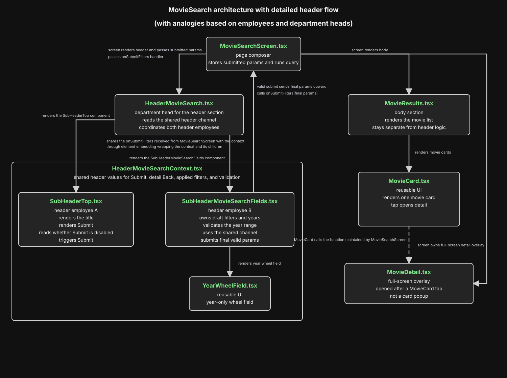

# MovieApp Application Architecture Notes

## Table of Contents

- [Why this note exists](#why-this-note-exists)
- [Architecture diagram](#architecture-diagram)
- [Current structure](#current-structure)
- [Android Direct TMDB Request Identity Fix](#android-direct-tmdb-request-identity-fix)
- [File role summary](#file-role-summary)
- [UAT test script](#uat-test-script)
- [Final takeaway](#final-takeaway)

## Why this note exists

This note captures the discussion around:

- why the app now has `header/`, `body/`, and `ui/` folders
- why the two header siblings need a parent
- why the shared header context exists
- how this pattern could extend later if we add a footer
- why Android direct TMDB calls use one shared Axios request identity for the Home page

This is meant to be a plain-English explanation of the architecture, not just a file inventory.

## Architecture diagram

[](./assets/header-body-hierarchy.svg)

Direct file link: [header-body-hierarchy.svg](./assets/header-body-hierarchy.svg)

### How to read the hierarchy

- Top level:
  - `MovieSearchScreen`

- Under `MovieSearchScreen`:
  - `HeaderMovieSearch`
  - `MovieResults`

- Under `HeaderMovieSearch`:
  - `SubHeaderTop`
  - `SubHeaderMovieSearchFields`
  - `HeaderMovieSearchContext`

- Under `SubHeaderMovieSearchFields`:
  - `YearWheelField`

- Under `MovieResults`:
  - `MovieCard`
  - `MovieDetail` full-screen overlay

### Even simpler tree view

```text
MovieSearchScreen
├── HeaderMovieSearch
│   ├── SubHeaderTop
│   ├── SubHeaderMovieSearchFields
│   │   └── YearWheelField
│   └── HeaderMovieSearchContext
└── MovieResults
    ├── MovieCard
    └── MovieDetail (full-screen overlay)
```

### How to read the shared clipboard / radio flow inside the diagram

- `SubHeaderTop` and `SubHeaderMovieSearchFields` both use the shared clipboard / radio
- `HeaderMovieSearchContext` is that shared clipboard / radio
- `HeaderMovieSearch` reads that shared channel as the department head
- `SubHeaderMovieSearchFields` still sends the final valid params back up to `MovieSearchScreen`

## Current structure

### Screen

- [MovieSearchScreen.tsx](../src/screens/MovieSearchScreen.tsx)

This is the page-level screen.

Its job is now mostly:

- own the submitted movie-search params
- run the query hook
- render the parent header section
- render the results body section

It is intentionally closer to a page composer than a giant state bucket.

### Header folder

- [HeaderMovieSearch.tsx](../src/components/header/HeaderMovieSearch.tsx)
- [SubHeaderTop.tsx](../src/components/header/SubHeaderTop.tsx)
- [SubHeaderMovieSearchFields.tsx](../src/components/header/SubHeaderMovieSearchFields.tsx)
- [HeaderMovieSearchContext.tsx](../src/components/header/HeaderMovieSearchContext.tsx)

These files are specifically about the page header and its coordination.

### Body folder

- [MovieResults.tsx](../src/components/body/MovieResults.tsx)

This is the reusable results-list/detail body section.

### UI folder

- [MovieCard.tsx](../src/components/ui/MovieCard.tsx)
- [YearWheelField.tsx](../src/components/ui/YearWheelField.tsx)

These are reusable visual building blocks.

The `ui` folder is for things that are more like shared visual widgets than page-structure containers.

## Android Direct TMDB Request Identity Fix

### Context

The Home page intentionally gets its carousel rows directly from TMDB, matching the legacy app. The Advanced Search page is different: it intentionally uses the Cloudflare movie-search endpoint.

That separation matters:

- the Home page uses TMDB directly for featured, popular, and genre carousel rows
- the Advanced Search page uses the Cloudflare search endpoint
- those two paths should stay separate unless we deliberately decide to redesign the app

### What happened

Android started showing `Network Error` for several Home-page rows. iOS loaded the same Home page correctly, and Advanced Search still worked on Android.

That combination narrowed the problem quickly:

- Advanced Search was not proof that direct TMDB worked, because Advanced Search calls our Cloudflare Worker.
- iOS was not proof that Android should work, because iOS and Android use different native network stacks.
- The affected path was Android direct-to-TMDB Home-page traffic.

### Why this could break after previously working

The app did not need to change for this to appear. The Home page depends on a live external API, and TMDB sits behind normal internet infrastructure such as CDNs, security filters, and compression behavior. Those layers can change independently of this app.

The most useful way to describe the failure is this:

- React Native Android sends JavaScript network requests through Android's native network layer.
- React Native iOS sends requests through Apple's native networking stack.
- A browser, iOS, Android, and a backend server can all look different to an external API, even when they request the same URL.
- If an external API or its edge/security layer treats one client identity differently, Android can fail while iOS and browser tests still pass.

We did not prove a public TMDB rule that says Android is blocked. The evidence was app-specific: Android direct TMDB calls failed, while iOS and Cloudflare-backed calls worked. The safest fix is therefore scoped to the direct TMDB request path we own.

### High-level fix

The final fix is intentionally simple:

- Direct TMDB calls go through the shared Axios client in [client.ts](../src/api/tmdb/client.ts).
- On Android, that Axios client sends a normal mobile-browser-style `User-Agent`.
- The Home-page TMDB service in [movieService.ts](../src/api/tmdb/services/movieService.ts) uses that Axios client for featured, popular, and genre rows.
- The code does **not** set `Accept-Encoding`.
- The code does **not** manually unzip gzip responses.
- There is **no** Android Kotlin network hook for this fix.

In plain English: Android now introduces the app's direct TMDB requests more like a normal mobile browser, and the app keeps compression handling on the normal React Native/Android path.

### The important gzip lesson

This is the part that is easy to get backwards.

Android's network stack normally handles response compression for us when the app does **not** provide `Accept-Encoding` itself.

This can feel backwards because many HTTP examples do set `Accept-Encoding`. That is normal when a program wants to choose a response encoding, for example asking for `gzip`, Brotli, or `identity` to avoid compression.

The key distinction is responsibility:

- If the app leaves `Accept-Encoding` absent, the normal Android/React Native network path owns compression and returns decoded JSON to JavaScript.
- If the app sets `Accept-Encoding: identity`, there should be nothing to decompress **if the server honors it**.
- If the app sets any `Accept-Encoding` value, the app has taken responsibility for making sure the response encoding and app decoding still match.

That responsibility is the fragile part. The final fix avoids it.

Why not force `Accept-Encoding: identity`?

- It makes every TMDB response larger because it asks for uncompressed JSON.
- It still depends on TMDB's server or CDN honoring that request every time.
- It bypasses the normal Android network behavior that already knows how to handle common compressed responses.

So we do not need to know every encoding TMDB might support. We leave compression alone and only fix the request identity problem.

So the final rule is:

- Do **not** set `Accept-Encoding: gzip` from JavaScript.
- Do **not** set `Accept-Encoding: identity` as the permanent fix.
- Do **not** manually unzip responses unless we have a separate, proven reason.
- Let React Native Android own the normal compression path.

The earlier manual gzip-normalization experiment was useful because it taught us where the failure surface was, but it is not the final maintenance pattern. The final code removes that extra moving part.

### Files involved

The fix lives in the TypeScript API layer:

- [client.ts](../src/api/tmdb/client.ts)
- [movieService.ts](../src/api/tmdb/services/movieService.ts)

[client.ts](../src/api/tmdb/client.ts) owns the shared direct-TMDB Axios configuration:

- base TMDB URL
- timeout
- `Accept: application/json`
- Android-only browser-like `User-Agent`

[movieService.ts](../src/api/tmdb/services/movieService.ts) uses that Axios client for Home-page TMDB rows.

### Why this now lives in Axios instead of Android native code

The native Kotlin hook was removed because the final fix does not need platform-level socket customization.

That matters for maintenance:

- The proven app-owned direct TMDB calls already live in the TypeScript service layer.
- Request identity is a request-header policy, not a reason by itself to alter React Native's Android network client.
- Keeping it in Axios makes the rule visible where TMDB requests are built.
- It avoids native Android code that future maintainers could reasonably miss during React Native, Gradle, Java, or Kotlin upgrades.

The tradeoff is deliberate:

- Any future direct TMDB call must use `tmdbClient`.
- Do not add raw `fetch(...)` or standalone `axios.get(...)` calls to TMDB from screens or random helpers.
- If a future failure proves that headers in Axios are not enough, then revisit a native network hook with fresh evidence.

### Why this can be an Axios helper

The fix we need is:

- send a browser-like Android `User-Agent` for direct TMDB API requests
- do not take over compression handling

That is exactly what [client.ts](../src/api/tmdb/client.ts) can centralize.

The earlier native-hook idea was stronger than needed because it tried to guarantee behavior for any future direct TMDB request, even if someone bypassed the TypeScript API client. That kind of future-proofing is not enough reason to add native code.

The simpler maintenance rule is better:

- direct TMDB API calls use `tmdbClient`
- Advanced Search continues using Cloudflare
- native Android networking remains unchanged

### What logcat showed

The failing Android log was useful because it separated "TMDB did not answer" from "Android could not deliver the answer cleanly to JavaScript."

Before the fix, logcat showed this pattern:

```text
TMDB response 200: https://api.themoviedb.org/3/movie/upcoming?...
[Home TMDB request failed] { label: 'upcoming', error: [TypeError: Network request failed] }
```

The same pattern appeared for multiple Home-page rows, including:

- `upcoming`
- `genre-10751` family
- `genre-35` comedy
- `genre-18` drama
- `genre-80` crime
- `genre-27` horror
- `genre-99` documentary

That proved Android was reaching TMDB, but React Native JavaScript was still receiving a generic network failure.

During diagnostic work, one manual gzip-normalization attempt exposed this lower-level error:

```text
java.io.IOException: gzip finished without exhausting source
  at okio.GzipSource.read(...)
  at okhttp3.ResponseBody.string(...)
```

That error came from the diagnostic gzip-normalization path, not from the final fix. The final lesson from that error is: do not force or manually own gzip unless we have to. Let OkHttp and React Native handle compression normally by leaving `Accept-Encoding` unset.

### What the Android and React Native community does for this class of issue

There is not one universal Android patch for every API-specific `Network request failed` problem. The responsible pattern is to prove which layer failed, then fix that layer.

For React Native Android, that usually means:

- Use logcat or another native network diagnostic to confirm whether the server responded.
- If the server never responded, investigate URL, DNS, TLS, auth, firewall, or server availability.
- If the server returned HTTP `200` but JavaScript still received `TypeError: Network request failed`, inspect the native Android networking handoff.
- If request headers are enough, keep the policy in JavaScript.
- If the app later proves it needs a platform-level network hook, scope that hook tightly and document why the JavaScript client was not enough.

For this app, the final proven maintenance pattern is:

- direct TMDB Home-page calls go through `tmdbClient`
- Android direct TMDB requests keep a browser-like `User-Agent`
- `Accept-Encoding` is not set by the app
- compression is left to React Native Android

### What this would look like in Expo

Expo developers are not automatically stuck, because the final fix is TypeScript/Axios-based.

- Expo Go only:
  - This Axios header approach can work because it is JavaScript code.
  - If a future issue required native network hooks, Expo Go would not be enough because Expo Go is a prebuilt app.

- Expo development build:
  - A development build would only be needed if the app later required custom native Android network code.

- Server/proxy fallback:
  - Put a small backend or Cloudflare Worker between the app and the external API.
  - The proxy calls TMDB and returns a response shape the app controls.
  - This avoids native code but adds another service and changes the app's network path.

Reference links for maintainers:

- [Expo config plugins](https://docs.expo.dev/config-plugins/introduction/)
- [Expo development builds](https://docs.expo.dev/develop/development-builds/introduction/)
- [Expo prebuild](https://docs.expo.dev/workflow/prebuild/)

### Why this stays out of Advanced Search

Advanced Search already goes through the Cloudflare movie-search API.

The Home page does not.

So this fix is intentionally narrow:

- Home-page direct TMDB requests get the Android browser-like request identity through `tmdbClient`.
- Advanced Search continues using Cloudflare.
- Other app requests are not changed.

### Verification

The fix should be verified with:

- `npm run tsne`
- `cd android && ./gradlew assembleDebug`
- Android emulator or device launch of the Home page
- Android log review confirming successful TMDB responses for featured, popular, family, comedy, drama, crime, horror, music, and documentary rows

The key passing behavior is not just HTTP `200`; the app must also receive usable JSON and render the Home-page rows without `Network Error`.

## The family/company analogy

The easiest mental model we landed on was this:

- `MovieSearchScreen` = the larger company office
- `HeaderMovieSearch` = the department head
- `SubHeaderTop` = employee A
- `SubHeaderMovieSearchFields` = employee B
- `HeaderMovieSearchContext` = the shared clipboard / hallway radio
- `MovieResults` = another department in the office, but not part of the header chain

## Why the two header children still exist

`HeaderMovieSearch` did **not** replace the children.

It became the coordinator.

The children still do the visible work:

- [SubHeaderTop.tsx](../src/components/header/SubHeaderTop.tsx)
  renders the top bar and the `Submit` button

- [SubHeaderMovieSearchFields.tsx](../src/components/header/SubHeaderMovieSearchFields.tsx)
  renders the filter controls, year wheels, validation, and summary

So the parent is the manager, not the worker doing both jobs itself.

## Why siblings cannot directly talk to each other

In React, the normal direction is:

- parent -> child through props
- child -> parent through callbacks/events

Siblings do not automatically get a direct communication line just because they are both already mounted on screen.

That means:

- `SubHeaderMovieSearchFields` knows when the year range is invalid
- `SubHeaderTop` owns the visible `Submit` button
- but one sibling does not directly mutate the other sibling

Instead, shared state has to move through a shared path.

## Why the parent header exists

We wanted:

- the search fields to be the real trigger/source of truth for validity
- the top header to reflect that by disabling the button
- `MovieSearchScreen` to stay mostly dumb

So we introduced:

- [HeaderMovieSearch.tsx](../src/components/header/HeaderMovieSearch.tsx)

Its job is to be the shared parent that coordinates the two header children without pushing all of that sibling wiring back into the screen.

That lets the screen stay more like:

- "render header"
- "render body"
- "run query from submitted params"

instead of becoming the communication hub for every header detail.

## Why the shared clipboard/radio exists

This was the extra question:

If the parent already exists, why also create:

- [HeaderMovieSearchContext.tsx](../src/components/header/HeaderMovieSearchContext.tsx)

### Short answer

It is a shared room-level communication channel for the header section.

It is **not** another visible component.
It is **not** another boss.
It is just the agreed way for the parent and both children to read/write the same shared header information.

### Analogy version

Without the clipboard/radio:

- the department head would need to personally walk over to employee A
- then walk over to employee B
- then walk back again every time a shared fact changed

With the clipboard/radio:

- the department head keeps one official shared note board
- both employees can read from it
- employee B can report "the year range is invalid"
- employee A can see "disable submit"
- the department head still owns the system, but does not hand-copy every message separately every time

### React version

The shared header state includes things like:

- applied params
- loaded pages / total pages
- whether submit should be disabled
- how to submit draft filters
- how the field section can register its submit handler

Context makes that shared coordination cleaner than threading a lot of props manually through just the header subtree.

## Important clarification

The context file is a mechanism, not a visual layer.

So the real visual/structural hierarchy is still:

1. [MovieSearchScreen.tsx](../src/screens/MovieSearchScreen.tsx)
2. [HeaderMovieSearch.tsx](../src/components/header/HeaderMovieSearch.tsx)
3. [SubHeaderTop.tsx](../src/components/header/SubHeaderTop.tsx)
4. [SubHeaderMovieSearchFields.tsx](../src/components/header/SubHeaderMovieSearchFields.tsx)

The context is just the shared hallway clipboard those pieces use.

## Could we remove the context later?

Yes.

For only two children, a parent can absolutely pass everything directly as props/callbacks instead.

That would be simpler in one way:

- less abstraction
- fewer files

But context is cleaner in another way:

- less prop drilling inside the header subtree
- one shared communication channel for the whole header section

So this is a design choice, not a hard React requirement.

## Why the body does not need the same kind of department head

- [MovieResults.tsx](../src/components/body/MovieResults.tsx)

This component is a sibling to the header area, but right now it does not need to coordinate closely with the header in the same way.

It mostly needs:

- the current movie list
- optional pagination callbacks
- optional header content passed in

So it does not need its own shared coordinator at the moment.

## How a future footer could fit

If we later add a footer, there are a few good options.

### Case 1: simple footer

If the footer is mostly static or self-contained, then:

- `MovieSearchScreen` can just render it below the header/body

Example mental structure:

- `HeaderMovieSearch`
- `MovieResults`
- `FooterSomething`

### Case 2: footer needs shared page coordination

If the footer needs to react to header/body state, then we have two choices:

1. let `MovieSearchScreen` bridge the shared data
2. introduce a page-level parent/context above header + body + footer

That second option would look like:

- `PageMovieSearch`
  - header
  - body
  - footer

and then the page-level parent would become the bigger coordinator.

### Case 3: footer belongs only to the header area

If the footer is really more like a bottom strip of header controls, then it may belong under the `header/` folder instead of becoming a page-level footer.

So the folder choice depends on what the footer *means*, not just where it visually appears.

## The current pattern in one sentence

The app now separates:

- page composition
- header coordination
- body rendering
- reusable UI widgets

so that each layer has a clearer job and we do not keep stuffing every concern into one screen file.

## File role summary

### Page composer

- [MovieSearchScreen.tsx](../src/screens/MovieSearchScreen.tsx)

### Header coordinator

- [HeaderMovieSearch.tsx](../src/components/header/HeaderMovieSearch.tsx)

### Header children

- [SubHeaderTop.tsx](../src/components/header/SubHeaderTop.tsx)
- [SubHeaderMovieSearchFields.tsx](../src/components/header/SubHeaderMovieSearchFields.tsx)

### Header shared channel

- [HeaderMovieSearchContext.tsx](../src/components/header/HeaderMovieSearchContext.tsx)

### Body

- [MovieResults.tsx](../src/components/body/MovieResults.tsx)

### Shared UI parts

- [MovieCard.tsx](../src/components/ui/MovieCard.tsx)
- [YearWheelField.tsx](../src/components/ui/YearWheelField.tsx)

## UAT test script

This script is a practical user-acceptance checklist for testing the app after code changes. It is organized by where you are in the app so the tester can move through the app naturally instead of reading one long mixed list.

Run this script on both platforms when the change could affect shared app behavior:

- iOS simulator or physical iPhone
- Android emulator or physical Android device

For a narrow visual change, test the directly affected area plus the drawer and one movie detail screen. For release-candidate testing, run the full script.

### UAT setup

Before starting:

1. Install the latest debug or release-candidate build on the test device.
2. Start from a fresh app launch.
3. Confirm the device has internet access.
4. If testing list storage behavior, know whether the device already has saved favorite or seen movies.
5. If testing push notification settings, use a build/environment where OneSignal is configured.

Pass criteria:

- The app launches without a crash.
- No screen is blank unless the empty state text explains why.
- Text is readable and not overlapping.
- Taps, drawer navigation, scrolling, and back behavior work.
- Movie data loads where network-backed data is expected.

### 1. Home screen

Goal: Confirm the app opens correctly and the TMDB-backed home content renders.

1. Launch the app.
2. Confirm the hero movie image fills the top area.
3. Confirm the app logo/menu button is visible at the top left.
4. Confirm the search icon is visible at the top right.
5. Confirm the `Popular Movies` row loads movie posters.
6. Scroll down and confirm at least one additional movie row loads.
7. Horizontally scroll a movie row.
8. Tap a movie poster.

Expected result:

- The Home screen loads without `Network Error`.
- Movie poster rows render images.
- Horizontal row scrolling is smooth.
- Tapping a poster opens Movie Details.

### 2. Movie Details

Goal: Confirm the detail page opens from a movie card and the detail controls behave correctly.

1. From Home or search results, tap a movie poster.
2. Confirm the movie poster, title, genres, rating row, overview, rating certificate, and release date render.
3. Confirm the favorite heart is visible.
4. Confirm the seen button is visible.
5. Tap the favorite heart.
6. Tap the seen button.
7. Scroll to the cast and crew sections.
8. Tap a cast member if available.
9. Use the back button to return from the person/detail flow.
10. Use the movie detail back button to return to the prior list.

Expected result:

- Movie Details opens without a crash.
- Favorite and seen controls visually respond.
- Cast and crew rows render when data is available.
- Back navigation returns to the prior screen without losing the app state.

### 3. Drawer navigation

Goal: Confirm the drawer is readable and each route opens the right area.

1. Open the drawer from the Home screen.
2. Confirm the drawer header logo and `It's Movie Time` text are readable.
3. Confirm these primary drawer items are visible:
   - Home
   - My Movie Favorites
   - Movies I Have Seen
   - Advanced Search
   - Settings
4. Confirm these secondary drawer items are visible at the bottom:
   - Tell a Friend
   - Privacy Policy
5. Confirm selected and unselected drawer text/icons use the intended brand styling.
6. Tap each primary drawer item and confirm the correct screen opens.
7. Reopen the drawer after each navigation.

Expected result:

- The drawer opens and closes cleanly.
- Primary and secondary drawer labels are readable.
- Selected row shading is visible.
- Every drawer item routes to the expected screen.

### 4. Favorites and seen lists

Goal: Confirm saved movie lists show empty states and saved movies correctly.

1. Open `My Movie Favorites` from the drawer.
2. If no favorites exist, confirm the empty state says `No favorite movies yet.`
3. Open `Movies I Have Seen` from the drawer.
4. If no seen movies exist, confirm the empty state says `No seen movies yet.`
5. Go back to Home and open Movie Details.
6. Mark a movie as favorite.
7. Mark a movie as seen.
8. Return to the Favorites screen.
9. Return to the Seen screen.
10. Tap the saved movie from each list.

Expected result:

- Empty states use readable brand styling.
- Saved movies appear in the correct list.
- Tapping a saved movie opens Movie Details.
- Removing favorite/seen status updates the related list after navigating back.

### 5. Advanced Search

Goal: Confirm the filter UI, submit flow, and result list work.

1. Open `Advanced Search` from the drawer.
2. Confirm the top title says `Movie Search`.
3. Confirm the `Search by Title` link is visible.
4. Confirm the filter area shows:
   - Released year
   - To year
   - Genre
   - Rating
   - Streaming
   - Sort
5. Tap `Hide Filter`, then tap `Show Filter`.
6. Change the begin year and end year.
7. Select at least one genre.
8. Select at least one rating.
9. Select at least one streaming service if available.
10. Select a sort option.
11. Tap `Submit`.
12. Scroll the result list.
13. Tap a result movie.
14. Return from Movie Details to the results.

Expected result:

- Filters open and close correctly.
- Modal controls are readable and tappable.
- Invalid year ranges disable or block submit behavior.
- Valid searches return results or a clear empty state.
- Result cards open Movie Details.

### 6. Search by title

Goal: Confirm title search works independently from Advanced Search filters.

1. Open `Search by Title` from the Advanced Search header link or the search icon flow.
2. Type a known movie title.
3. Submit the search.
4. Confirm results appear.
5. Tap a result.
6. Return to the title results.
7. Clear the search text and try another title.

Expected result:

- Typing and submitting works.
- Results are relevant to the entered title.
- Movie Details opens from title results.
- Back navigation returns to the title result list.

### 7. Settings

Goal: Confirm app settings, version details, and maintenance actions render correctly.

1. Open `Settings` from the drawer.
2. Confirm the settings page loads without a blank screen.
3. Review the Software Version section.
4. Confirm Apple Store Details shows a version/status line.
5. Confirm Google Play Store Details shows a version/status line.
6. Tap the Apple Store Details row if available.
7. Tap the Google Play Store Details row if available.
8. Review push notification settings if shown.
9. Review clear-list actions if shown.

Expected result:

- Settings content is readable.
- Store-version rows do not show confusing or stale placeholder text.
- Tapping store detail rows either opens useful details or fails gracefully.
- Destructive maintenance actions require clear user intent.

### 8. Tell a Friend

Goal: Confirm the share sheet opens from the secondary drawer link.

1. Open the drawer.
2. Tap `Tell a Friend`.
3. Confirm the native share sheet opens.
4. Dismiss the share sheet.

Expected result:

- The share sheet opens without crashing.
- Dismissing the share sheet returns to the app.

### 9. Privacy Policy

Goal: Confirm the privacy page opens and is readable.

1. Open the drawer.
2. Tap `Privacy Policy`.
3. Confirm the privacy policy screen opens.
4. Scroll through the content.
5. Return to the previous screen or drawer.

Expected result:

- The page opens from the secondary drawer link.
- Text is readable.
- Scrolling works.

### 10. Cross-platform visual pass

Goal: Catch layout differences between iOS and Android.

Run this quick pass on both iOS and Android:

1. Home screen first viewport.
2. Home screen scrolled to movie rows.
3. Drawer open.
4. Movie Details.
5. Advanced Search filters visible.
6. Favorites empty state or populated state.
7. Seen empty state or populated state.
8. Settings screen.

Expected result:

- No text overlaps other controls.
- Brand colors are consistent.
- Icons are visible and not too light or too dark.
- Buttons and rows have enough tap area.
- Safe-area spacing works around notches, status bars, and bottom gestures.

### 11. Regression smoke checks

Goal: Confirm the app still works after code structure or styling changes.

1. Launch the app cold.
2. Open drawer.
3. Navigate to every drawer route.
4. Open one Movie Detail screen.
5. Mark a movie favorite.
6. Mark a movie seen.
7. Run one Advanced Search.
8. Run one title search.
9. Open Settings.
10. Relaunch the app.

Expected result:

- No crash during navigation.
- Saved favorite/seen state persists after relaunch.
- Network-backed screens either load data or show a clear recoverable message.

### UAT result template

Use this template when recording a pass:

```text
Build:
Platform:
Device/Simulator:
Tester:
Date:

Home:
Movie Details:
Drawer:
Favorites:
Seen:
Advanced Search:
Search by Title:
Settings:
Tell a Friend:
Privacy Policy:
Cross-platform visual notes:

Blocking issues:
Non-blocking issues:
Screenshots/video captured:
Final result: Pass / Fail
```

## Final takeaway

The new parent header exists because two visible header siblings need to stay coordinated.

The context exists because it gives that header family one shared communication board.

The screen stays simpler because it no longer has to personally mediate every single interaction between those two header children.
