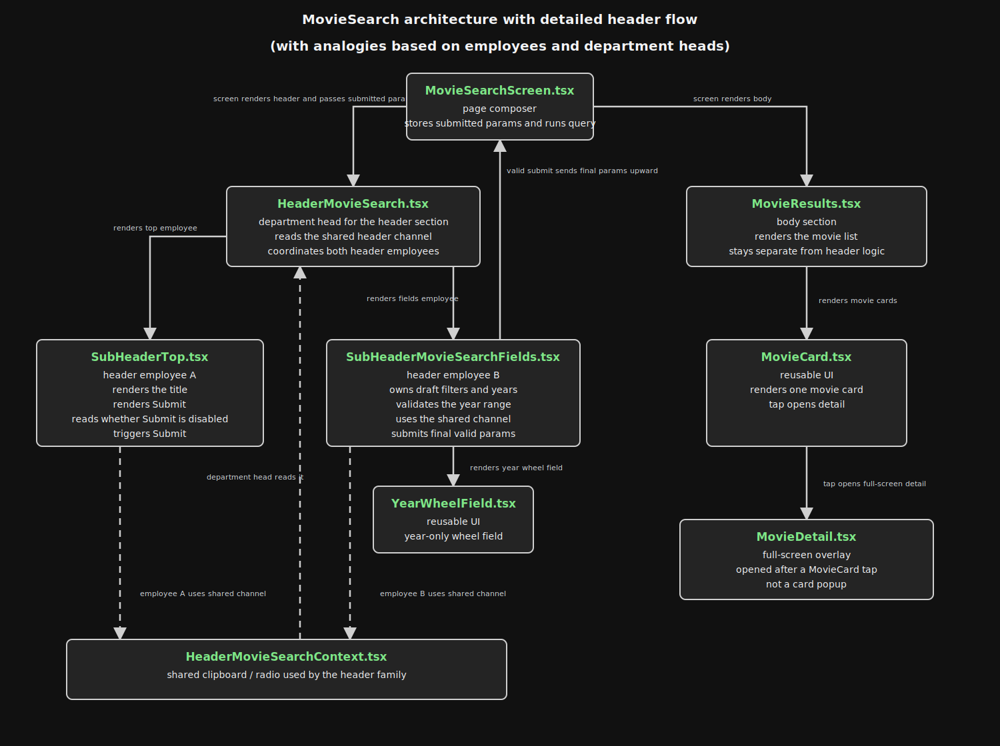

# Header, Body, and Shared Parent Notes

## Why this note exists

This note captures the discussion around:

- why the app now has `header/`, `body/`, and `ui/` folders
- why the two header siblings need a parent
- why the shared header context exists
- how this pattern could extend later if we add a footer

This is meant to be a plain-English explanation of the architecture, not just a file inventory.

## Architecture diagram

[](./header-body-hierarchy.svg)

Direct file link: [header-body-hierarchy.svg](./header-body-hierarchy.svg)

### How to read the hierarchy

- Top level:
  - `MovieSearchScreen`

- Under `MovieSearchScreen`:
  - `HeaderMovieSearch`
  - `MovieResults`

- Under `HeaderMovieSearch`:
  - `SubHeaderTop`
  - `SubHeaderMovieSearchFields`
  - `HeaderMovieSearchContext`

- Under `SubHeaderMovieSearchFields`:
  - `YearWheelField`

- Under `MovieResults`:
  - `MovieCard`
  - `MovieDetail` full-screen overlay

### Even simpler tree view

```text
MovieSearchScreen
├── HeaderMovieSearch
│   ├── SubHeaderTop
│   ├── SubHeaderMovieSearchFields
│   │   └── YearWheelField
│   └── HeaderMovieSearchContext
└── MovieResults
    ├── MovieCard
    └── MovieDetail (full-screen overlay)
```

### How to read the shared clipboard / radio flow inside the diagram

- `SubHeaderTop` and `SubHeaderMovieSearchFields` both use the shared clipboard / radio
- `HeaderMovieSearchContext` is that shared clipboard / radio
- `HeaderMovieSearch` reads that shared channel as the department head
- `SubHeaderMovieSearchFields` still sends the final valid params back up to `MovieSearchScreen`

## Current structure

### Screen

- [MovieSearchScreen.tsx](/Users/croncallo/repo/MovieApp/src/screens/MovieSearchScreen.tsx)

This is the page-level screen.

Its job is now mostly:

- own the submitted movie-search params
- run the query hook
- render the parent header section
- render the results body section

It is intentionally closer to a page composer than a giant state bucket.

### Header folder

- [HeaderMovieSearch.tsx](/Users/croncallo/repo/MovieApp/src/components/header/HeaderMovieSearch.tsx)
- [SubHeaderTop.tsx](/Users/croncallo/repo/MovieApp/src/components/header/SubHeaderTop.tsx)
- [SubHeaderMovieSearchFields.tsx](/Users/croncallo/repo/MovieApp/src/components/header/SubHeaderMovieSearchFields.tsx)
- [HeaderMovieSearchContext.tsx](/Users/croncallo/repo/MovieApp/src/components/header/HeaderMovieSearchContext.tsx)

These files are specifically about the page header and its coordination.

### Body folder

- [MovieResults.tsx](/Users/croncallo/repo/MovieApp/src/components/body/MovieResults.tsx)

This is the reusable results-list/detail body section.

### UI folder

- [MovieCard.tsx](/Users/croncallo/repo/MovieApp/src/components/ui/MovieCard.tsx)
- [YearWheelField.tsx](/Users/croncallo/repo/MovieApp/src/components/ui/YearWheelField.tsx)

These are reusable visual building blocks.

The `ui` folder is for things that are more like shared visual widgets than page-structure containers.

## The family/company analogy

The easiest mental model we landed on was this:

- `MovieSearchScreen` = the larger company office
- `HeaderMovieSearch` = the department head
- `SubHeaderTop` = employee A
- `SubHeaderMovieSearchFields` = employee B
- `HeaderMovieSearchContext` = the shared clipboard / hallway radio
- `MovieResults` = another department in the office, but not part of the header chain

## Why the two header children still exist

`HeaderMovieSearch` did **not** replace the children.

It became the coordinator.

The children still do the visible work:

- [SubHeaderTop.tsx](/Users/croncallo/repo/MovieApp/src/components/header/SubHeaderTop.tsx)
  renders the top bar and the `Submit` button

- [SubHeaderMovieSearchFields.tsx](/Users/croncallo/repo/MovieApp/src/components/header/SubHeaderMovieSearchFields.tsx)
  renders the filter controls, year wheels, validation, and summary

So the parent is the manager, not the worker doing both jobs itself.

## Why siblings cannot directly talk to each other

In React, the normal direction is:

- parent -> child through props
- child -> parent through callbacks/events

Siblings do not automatically get a direct communication line just because they are both already mounted on screen.

That means:

- `SubHeaderMovieSearchFields` knows when the year range is invalid
- `SubHeaderTop` owns the visible `Submit` button
- but one sibling does not directly mutate the other sibling

Instead, shared state has to move through a shared path.

## Why the parent header exists

We wanted:

- the search fields to be the real trigger/source of truth for validity
- the top header to reflect that by disabling the button
- `MovieSearchScreen` to stay mostly dumb

So we introduced:

- [HeaderMovieSearch.tsx](/Users/croncallo/repo/MovieApp/src/components/header/HeaderMovieSearch.tsx)

Its job is to be the shared parent that coordinates the two header children without pushing all of that sibling wiring back into the screen.

That lets the screen stay more like:

- "render header"
- "render body"
- "run query from submitted params"

instead of becoming the communication hub for every header detail.

## Why the shared clipboard/radio exists

This was the extra question:

If the parent already exists, why also create:

- [HeaderMovieSearchContext.tsx](/Users/croncallo/repo/MovieApp/src/components/header/HeaderMovieSearchContext.tsx)

### Short answer

It is a shared room-level communication channel for the header section.

It is **not** another visible component.
It is **not** another boss.
It is just the agreed way for the parent and both children to read/write the same shared header information.

### Analogy version

Without the clipboard/radio:

- the department head would need to personally walk over to employee A
- then walk over to employee B
- then walk back again every time a shared fact changed

With the clipboard/radio:

- the department head keeps one official shared note board
- both employees can read from it
- employee B can report "the year range is invalid"
- employee A can see "disable submit"
- the department head still owns the system, but does not hand-copy every message separately every time

### React version

The shared header state includes things like:

- applied params
- loaded pages / total pages
- whether submit should be disabled
- how to submit draft filters
- how the field section can register its submit handler

Context makes that shared coordination cleaner than threading a lot of props manually through just the header subtree.

## Important clarification

The context file is a mechanism, not a visual layer.

So the real visual/structural hierarchy is still:

1. [MovieSearchScreen.tsx](/Users/croncallo/repo/MovieApp/src/screens/MovieSearchScreen.tsx)
2. [HeaderMovieSearch.tsx](/Users/croncallo/repo/MovieApp/src/components/header/HeaderMovieSearch.tsx)
3. [SubHeaderTop.tsx](/Users/croncallo/repo/MovieApp/src/components/header/SubHeaderTop.tsx)
4. [SubHeaderMovieSearchFields.tsx](/Users/croncallo/repo/MovieApp/src/components/header/SubHeaderMovieSearchFields.tsx)

The context is just the shared hallway clipboard those pieces use.

## Could we remove the context later?

Yes.

For only two children, a parent can absolutely pass everything directly as props/callbacks instead.

That would be simpler in one way:

- less abstraction
- fewer files

But context is cleaner in another way:

- less prop drilling inside the header subtree
- one shared communication channel for the whole header section

So this is a design choice, not a hard React requirement.

## Why the body does not need the same kind of department head

- [MovieResults.tsx](/Users/croncallo/repo/MovieApp/src/components/body/MovieResults.tsx)

This component is a sibling to the header area, but right now it does not need to coordinate closely with the header in the same way.

It mostly needs:

- the current movie list
- optional pagination callbacks
- optional header content passed in

So it does not need its own shared coordinator at the moment.

## How a future footer could fit

If we later add a footer, there are a few good options.

### Case 1: simple footer

If the footer is mostly static or self-contained, then:

- `MovieSearchScreen` can just render it below the header/body

Example mental structure:

- `HeaderMovieSearch`
- `MovieResults`
- `FooterSomething`

### Case 2: footer needs shared page coordination

If the footer needs to react to header/body state, then we have two choices:

1. let `MovieSearchScreen` bridge the shared data
2. introduce a page-level parent/context above header + body + footer

That second option would look like:

- `PageMovieSearch`
  - header
  - body
  - footer

and then the page-level parent would become the bigger coordinator.

### Case 3: footer belongs only to the header area

If the footer is really more like a bottom strip of header controls, then it may belong under the `header/` folder instead of becoming a page-level footer.

So the folder choice depends on what the footer *means*, not just where it visually appears.

## The current pattern in one sentence

The app now separates:

- page composition
- header coordination
- body rendering
- reusable UI widgets

so that each layer has a clearer job and we do not keep stuffing every concern into one screen file.

## File role summary

### Page composer

- [MovieSearchScreen.tsx](/Users/croncallo/repo/MovieApp/src/screens/MovieSearchScreen.tsx)

### Header coordinator

- [HeaderMovieSearch.tsx](/Users/croncallo/repo/MovieApp/src/components/header/HeaderMovieSearch.tsx)

### Header children

- [SubHeaderTop.tsx](/Users/croncallo/repo/MovieApp/src/components/header/SubHeaderTop.tsx)
- [SubHeaderMovieSearchFields.tsx](/Users/croncallo/repo/MovieApp/src/components/header/SubHeaderMovieSearchFields.tsx)

### Header shared channel

- [HeaderMovieSearchContext.tsx](/Users/croncallo/repo/MovieApp/src/components/header/HeaderMovieSearchContext.tsx)

### Body

- [MovieResults.tsx](/Users/croncallo/repo/MovieApp/src/components/body/MovieResults.tsx)

### Shared UI parts

- [MovieCard.tsx](/Users/croncallo/repo/MovieApp/src/components/ui/MovieCard.tsx)
- [YearWheelField.tsx](/Users/croncallo/repo/MovieApp/src/components/ui/YearWheelField.tsx)

## Final takeaway

The new parent header exists because two visible header siblings need to stay coordinated.

The context exists because it gives that header family one shared communication board.

The screen stays simpler because it no longer has to personally mediate every single interaction between those two header children.
